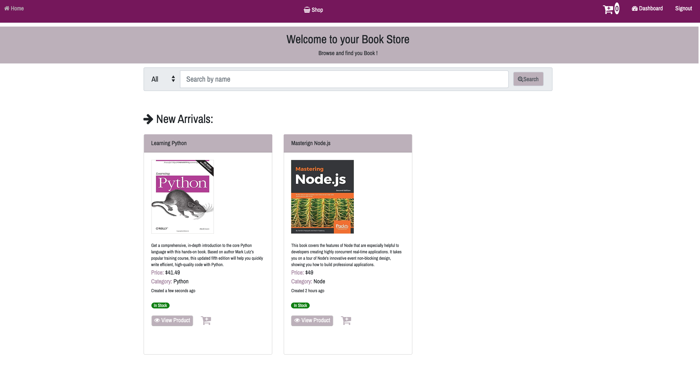
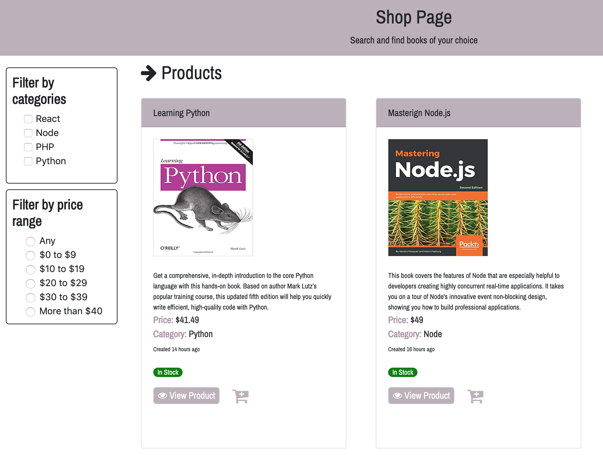

# BOOK STORE

## Project 

The application is a **book store** online where user can browse and buy books.

## ScreenShots

## Technologies Used

- `MongoDb`
- `Mongoose`
- `Express`
- `React`
- `Node.js`

### Styling

- `Bootstrap`
- `CSS`
- `HTML`
- `JavaScript`

### Authentication
- `JSON web token`

### Deployed on 
- [Digital Ocean](https://cloud.digitalocean.com/projects/b68048f4-938b-4274-a0be-6ff3dc8c8c67/resources?i=b12cb7)

### Third party API
- [braintree](https://www.npmjs.com/package/braintree-web-drop-in-react)

# Documentations
- Setup [digitalOceanSetup](https://www.digitalocean.com/community/tutorials/how-to-install-node-js-on-ubuntu-18-04)
- Creating [namecheap](https://www.namecheap.com/domains/registration/results.aspx?domain=bookstore) domain name

## Project link
Link of the app [here](http://138.197.209.39/)

## Future implementations

- Paypal payment
- Order process
- Shipping
